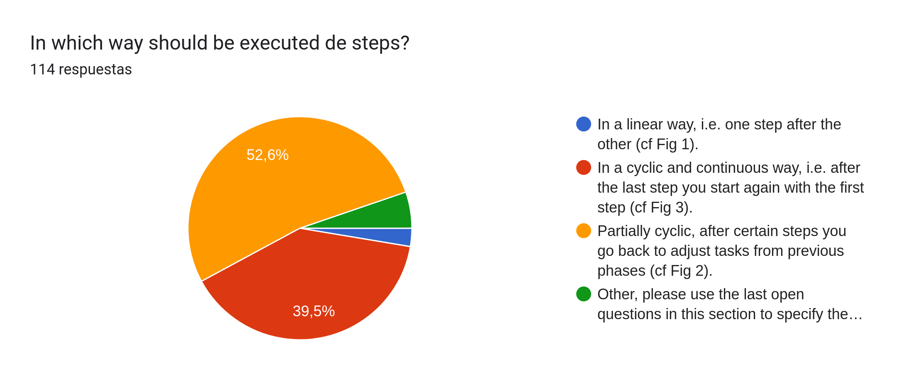

# Robotic software system integration 
This document comprises material we have collected in our effort to understand the current situation in software integration of robotic components, the challenges it presents, and what improvements would benefit the community.

## Survey 
Our first initiative was to conduct a survey that we disseminated through different channels to reach as many developers as possible.
The questionnaire, although already closed, can be found at: [https://forms.gle/nhtf5WSN5jScVn7NA](https://forms.gle/nhtf5WSN5jScVn7NA)

Hereafter we present an overview of the results.

### Section 1: Traditional process to develop software and its application for the software integration phase

#### Raw data

Top mentioned missing steps: 
- Prototyping phase 
- Existing solutions analysis 
- Formal analysis of source code 
- FAT/SAT - Acceptance test at integrator site, replicate acceptance test at customer site (Site Acceptance Test) 
- Discovery at runtime; data security; data management; online functionality updating 
- Hardware / Software Modification 
- Technology Maturation 
- Documentation 

Top proposal of alternative ways:
- Similar to cyclic, but not linear. 
- A mixture of Fig 2 and 3. Fig 2 alone is not sufficient because the requirements cannot be adapted. and Fig 3 is too strict and should allow reasonable shortcuts. 
- can be a good idea to mix fig 2 and fig 3, since sometimes you only need to change few things, sometimes you need to rethink the system design and the requirement analysis 
- It might not be fixed to one of the above but depending on the product, feature, release we might apply a different one 
- It can be useful to think of integration as a "tree" effort, where the overall system is broken down into subsystems, modules, and individual components.

#### Insights
- Big difference between industry and academia
- Currently the most followed step is “Code Implementation” but ideally it should be “V,V&T”

### Section 2: Challenges and improvements

#### Raw data 

#### Insights
- Very clearly the “Dynamically adaptation to the environment” is the major challenge. 
- “Interoperability” and “Reusability” are the challenges with lower score.

### Section 3: Tools in use

#### Raw data 

Top of categories in use tools: 
- VCS and CI/CD 
- Docker/ containerization 
- Simulators 
- IDEs 
- Model-based (SysML, UML graphical tool,  SmartMDSD) 
- Ros-specific (RQT, RVIZ; rosgrap..) 
- Custom in-house tools 

#### Insights
- Most used tools are graphical ones, followed by code generators.
- Tools used mainly for Code implementation (VSC, IDEs), VV&T (CI/CD, Simulator, ROS diagnostics tools) and deployment (containerization).

### Section 4: Desired tools to support the integrator

#### Raw data 

How can the tools help? Top answers (free-text question) 
- Standarization (19/78 responses) 
  - Common design tools 
  - Standardized and scalable examples and solutions modules 
  - Standard workflow for the entire development team 
  - … 
- Testing/VV (15/78 responses) 
  - Automate tests 
  - Test before deployment 
  - Check consistency and verification of the integration 
  - … 
- Single and unified platform for unification(5/78 responses) 
- Deployment helpers (5/78 responses) 
- Code generation (3/78 responses)

#### Insights
- We need more Standarization in robotics, and the use of tools can help on that.
- Validation, verification and testing are tedious and time-consuming tasks, it would be a great value if tools can help here, together with support for the design of the application. 
- There is no need, or people can’t see the need, of tools for the analysis of requirements. 
